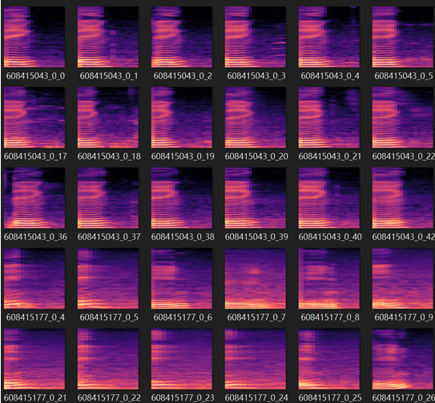
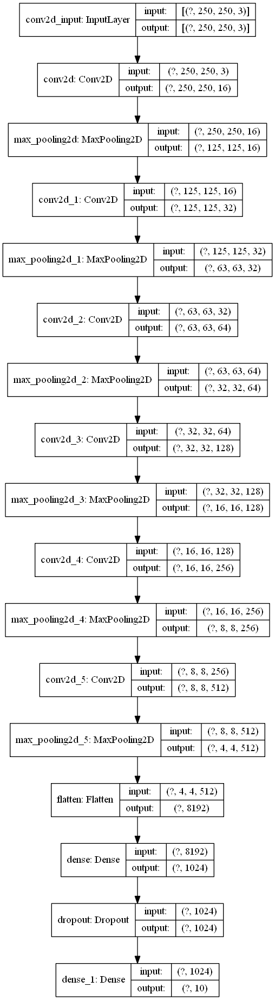
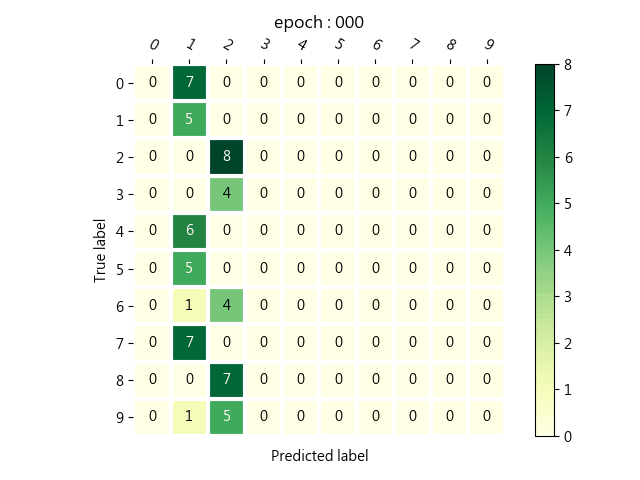
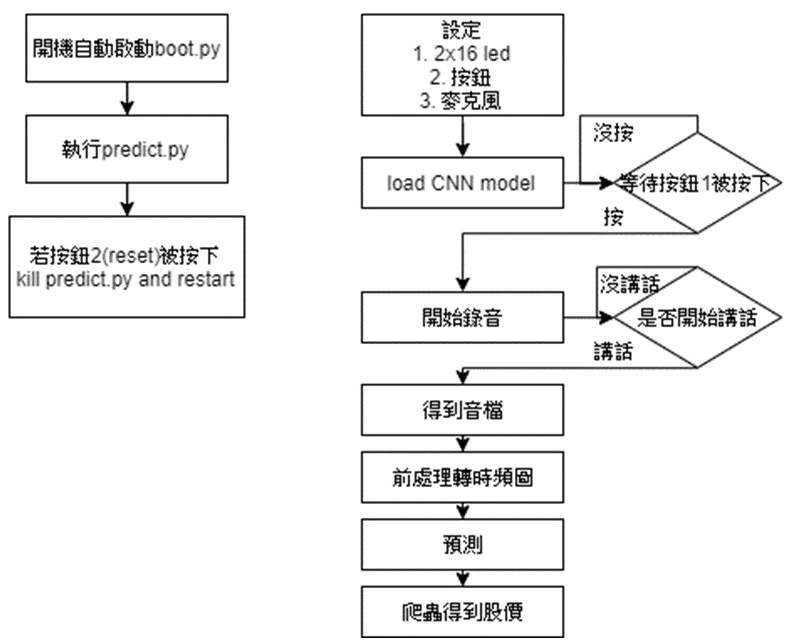

# 中正大學 2019 Fall COMM 4305175 微處理機系統與介面技術 final project
使用CNN model預測語音數字並爬取股價

# demo video

# Introduction
訓練可辨識中文語音數字的CNN model，並在樹梅派使用tensorflow lite預測並在有網路環境時爬取股價

## Spectrogram(use mfcc)

## CNN model(tensorflow 2.0.0)

## confusion matrix

## flow chart

我們使用crontab設定開機後自動啟動boot.py，並且利用subprocess執行predict.py並且得到此程式的process id，
若發生意外時，按下reset按鈕(使用中斷法)立即中止predict.py並重新啟動

在predict.py，一開始設定LCD1602,開始按鈕(使用中斷法)以及麥克風，使用librosa package將音檔轉成時頻圖，
用tensorflow lite預測，重複四次錄音即可得到預測的stock id，並且試著去爬取股價並透過外接喇叭撥放。

## Contributor
|name|Contribution|
|-------|----------|
| [鎧碩](https://github.com/henk2525) |40%|
| [弘宇](https://github.com/eric0318) |30%|
|浩程|30%|